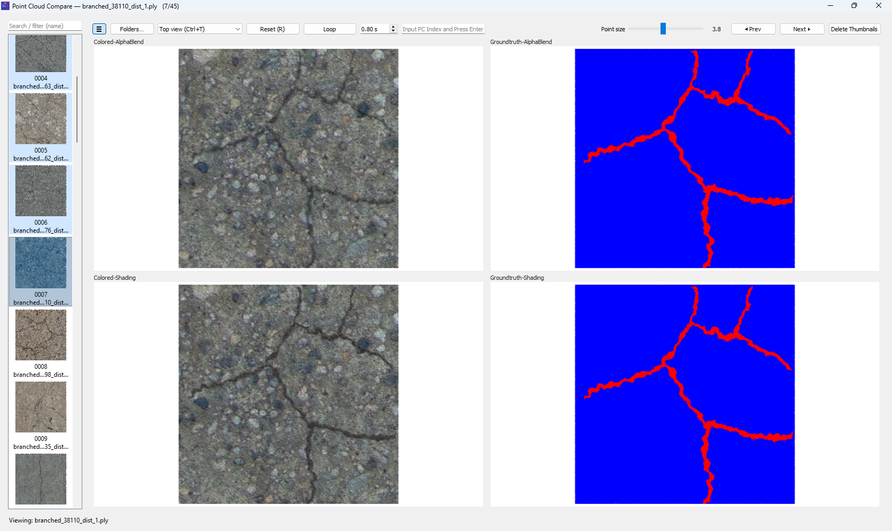

# Point Cloud Compare (PyQt5 + PyVista)

A fast, GPU‑accelerated point cloud comparison viewer for **PLY/PCD** datasets.

This tool is designed for workflows where you want to compare **two different methods** side‑by‑side (or in a 2×2 grid), and for each method you typically have:

- an **original** point cloud (input/output)
- an **annotation** point cloud (ground truth / labels / recolored semantics)

It supports **1–4 paired folders**, automatically builds a consistent frame list by **matching files by basename**, and keeps all view panes synchronized with a **linked orthographic camera**.



---

## Table of Contents

1. Overview
2. Highlights
3. Supported Data & Folder Layout
4. File Matching & Alignment Rules
5. Installation
6. Quick Start
7. Detailed Usage
8. Controls & Shortcuts
9. Rendering & Camera Behavior
10. Performance Notes
11. State & Persistence
12. Troubleshooting
13. Related Files
14. Contributing
15. License

---

## 1) Overview

The core idea of this viewer is simple: given **N folders (1–4)** containing point clouds, the app creates **N synchronized panes** showing the **same “frame index”** across all folders.

When you press **Next** (or the **Right Arrow**), every pane advances to the next corresponding file. This makes it easy to:

- visually compare output quality between methods (e.g., Method A vs Method B)
- compare original vs annotation for each method
- quickly scan large collections without repeatedly re-orienting the camera

The application is implemented in a single script:

- [app.py](python/app.py)

It uses:

- **PyQt5** for the UI
- **PyVista/VTK** for rendering
- **Open3D** for reading PLY/PCD and extracting points/colors

---

## 2) Highlights

- **1–4 panes (dynamic layout)**
  - 1 folder → 1 pane
  - 2 folders → 1×2 layout
  - 3–4 folders → 2×2 layout
- **Automatic file discovery**
  - Recursively loads `*.ply` / `*.pcd` (case-insensitive)
- **Robust pairing/alignment by filename**
  - Uses **basename intersection** (case-insensitive)
  - Pairs (0 ↔ 1) and (2 ↔ 3) when 4 folders are provided
- **Synchronized camera** across all panes
  - Orthographic projection (parallel camera)
  - View presets: Top/Bottom/Front/Back/Left/Right + four isometrics
- **Cursor-anchored wheel zoom** (AutoCAD‑style)
  - The point under the cursor stays under the cursor while zooming
- **Instant point-size control**
  - Slider updates all panes continuously
- **Loop mode**
  - Automatically cycles frames at a configurable delay
- **Jump to text box**
  - Jumps to the point cloud index number
- **Session persistence**
  - Remembers last selected folders and last viewed index

---

## 3) Supported Data & Folder Layout

### 3.1 Supported file formats

- `.ply` (ASCII or binary)
- `.pcd` (ASCII or binary)

Files are read via `open3d.io.read_point_cloud()`.

### 3.2 Color handling

- If the file includes per-point RGB colors, they are displayed **as stored**.
- If colors are missing, a neutral mid-gray is used.
- If colors appear to be stored as 0–255, they are normalized to 0–1.

No gamma/contrast/brightness modifications are applied in this viewer.

### 3.3 Recommended folder structure (two-method comparison)

A common usage is to compare **two methods**, where each method has **Original** and **Annotation** outputs.

Example:

- Folder 0: `.../MethodA/Original`
- Folder 1 (0 pair): `.../MethodA/Annotation`
- Folder 2: `.../MethodB/Original`
- Folder 3 (2 pair): `.../MethodB/Annotation`

When used this way, the 2×2 view acts as:

- Top-left: Method A (Original)
- Top-right: Method A (Annotation)
- Bottom-left: Method B (Original)
- Bottom-right: Method B (Annotation)

Note: The app does not impose semantic meaning on the folder order; the pane title simply shows the **folder name**. The “method/original/annotation” interpretation comes from how you pick folders.

---

## 4) File Matching & Alignment Rules

The viewer builds a “frame list” by crawling point-cloud files and then aligning them so that each pane displays matching filenames.

### 4.1 Recursive discovery

For each selected folder, the app recursively gathers:

- `**/*.ply`, `**/*.pcd` (case-insensitive variants are included)

Sorting is done using natural sorting (`natsort`) by relative path to keep ordering stable.

### 4.2 Alignment rules (important)

Alignment depends on how many folders are selected:

#### Case A — 1 folder

- The frame list is simply the sorted list of files in that folder.

#### Case B — 2 folders

- Folder 0 and Folder 1 are aligned by **basename intersection**.
- Only filenames present in **both** folders are included.

#### Case C — 3 folders

- Folders (0 ↔ 1) are aligned by basename intersection.
- Folder 2 is listed normally.
- The final length is truncated to the minimum of the three lists.

#### Case D — 4 folders

- Folders (0 ↔ 1) are aligned by basename intersection.
- Folders (2 ↔ 3) are aligned by basename intersection.
- The final frame count is the minimum of the two aligned pairs.

### 4.3 What “basename intersection” means

- Matching is performed on `os.path.basename(path)` only.
- Matching is **case-insensitive**.

So these are considered a match:

- `Scene_0007.ply` ↔ `scene_0007.ply`

But these are not:

- `scene_0007.ply` ↔ `scene_0007_anno.ply`

### 4.4 Practical advice

- Keep consistent filenames across method outputs.
- If you want to compare two different folder hierarchies, the relative subfolder layout does not need to match—only the basenames do.
- If you see “No aligned files found”, it typically means there is no basename overlap in one of the required pairs.

---

## 5) Installation

### 5.1 Requirements

- Python 3.9+ recommended (works well on 3.10–3.12)
- GPU + driver supporting OpenGL for VTK/PyVista
- Windows / Linux / macOS (primary workflows typically on Windows)

### 5.2 Python dependencies

The runtime dependencies used by [app.py](python/app.py) are:

- `PyQt5`
- `pyvista`
- `pyvistaqt`
- `vtk` (installed as a dependency of PyVista, but can be installed explicitly)
- `open3d`
- `numpy`
- `natsort`
- `appdirs`

### 5.3 Install (PowerShell example)

From this folder:

```powershell
python -m venv .venv
.\.venv\Scripts\Activate.ps1
python -m pip install --upgrade pip
pip install PyQt5 pyvista pyvistaqt vtk open3d numpy natsort appdirs
```

If you are using Conda, an equivalent approach is:

```powershell
conda create -n pointcloud_compare python=3.11
conda activate pointcloud_compare
pip install PyQt5 pyvista pyvistaqt vtk open3d numpy natsort appdirs
```

---

## 6) Quick Start

### 6.1 Run

```powershell
python .\app.py
```

Then:

1. Click **Folders…**
2. Multi-select **pair folders** (see “Recommended folder structure” above)
3. Use **Next ▶** / **◀ Prev** or **→ / ←** to navigate

### 6.2 Run with folders (CLI)

You can also pass folders directly:

```powershell
python .\app.py --folders "D:\data\MethodA\Original" "D:\data\MethodA\Annotation" "D:\data\MethodB\Original" "D:\data\MethodB\Annotation"
```

Notes:

- You can pass pair folders.
- Only the **first four** are used.

---

## 7) Detailed Usage

### 7.1 Pane titles

Each pane shows the **basename of the selected folder** as its title.

Example: if you choose `D:\data\MethodA\Original`, the pane title will show `Original`.

### 7.2 Frame label

The top-left area shows:

- `Frame i / N`
- The current filename (the basename from the first aligned list)

### 7.3 Point size

The **Point size** slider controls rendering size in pixels for all panes.

- Slider value maps to a float size in the range roughly `0.1 … 8.0`.

### 7.4 Loop mode

- Click **Loop** to auto-advance frames.
- Use the seconds spinner to set the delay between frames.

Loop behavior:

- Wraps around when reaching the end (`(idx + 1) % num_frames`).

---

## 8) Controls & Shortcuts

### 8.1 Navigation

- Next frame: **Right Arrow (→)** or **Next ▶**
- Previous frame: **Left Arrow (←)** or **◀ Prev**
- Jump to index: Enter point cloud index number to jump

### 8.2 View / camera

- Reset view (fit all panes): **R** or **Reset (R)** button
- Close window: **Esc**

### 8.3 View presets

The combo box includes these modes (and they all refit the camera to the current frame):

- Top view: **Ctrl+T**
- Bottom view: **Ctrl+B**
- Front view: **Ctrl+F**
- Back view: **Ctrl+V**
- Left view: **Ctrl+L**
- Right view: **Ctrl+R**
- SW Isometric: **Ctrl+W**
- SE Isometric: **Ctrl+E**
- NW Isometric: **Ctrl+I**
- NE Isometric: **Ctrl+O**

### 8.4 Mouse wheel zoom

- Mouse wheel zoom is **cursor-anchored**.
- The app intercepts the wheel event from each pane and applies a custom orthographic zoom so the point under the cursor stays stable.

---

## 9) Rendering & Camera Behavior

### 9.1 Shared orthographic camera

All panes share a single `pv.Camera()` instance:

- Parallel projection is enabled (`SetParallelProjection(True)`)
- A single camera is attached to every pane renderer

This guarantees:

- the same zoom level
- the same orientation
- the same pan offset

across all panes.

### 9.2 Fit-to-data logic

On every frame change, the app:

1. loads all panes’ point clouds
2. computes a global bounding box across the currently visible panes
3. repositions the camera based on the selected preset
4. sets `ParallelScale` based on the data diagonal

This avoids per-pane auto-fit (which causes distracting “shrink then grow” effects).

---

## 10) Performance Notes

### 10.1 Cached I/O

Point clouds are cached in-memory using an LRU cache:

- `load_cloud()` is decorated with `@lru_cache(maxsize=96)`

So revisiting nearby frames is significantly faster.

### 10.2 Rendering settings

The viewer uses `pyvistaqt.QtInteractor` and renders point clouds via `add_points()`.

A few performance-minded choices:

- point rendering uses spherical glyph rendering for consistent sizing
- lighting is disabled for “true-color” appearance

### 10.3 Practical tips

- For very dense clouds, reduce point size to avoid overdraw.
- Keep GPU drivers up to date.
- If you see stutters, reducing the number of panes (e.g., compare only two folders) will reduce GPU work.

---

## 11) State & Persistence

This viewer stores lightweight session state:

- last selected folder list (up to 4)
- last index

### 11.1 Where state is stored

The state file is:

- `viewer_state.json`

It is stored under the OS-specific app data folder as provided by `appdirs.user_data_dir()` with:

- `APP_NAME = "Point Cloud Compare"`

Typical location on Windows:

- `%LOCALAPPDATA%\Point Cloud Compare\viewer_state.json`

### 11.2 Resetting state

To reset “remembered folders” and index, delete the state file.

---

## 12) Troubleshooting

### 12.1 “No aligned files found”

Cause:

- Basenames do not overlap between required pair(s), especially (0 ↔ 1) or (2 ↔ 3).

Fix:

- Verify that both folders contain the same filenames (ignoring case).
- Ensure you selected the correct folder roots.

### 12.2 Blank/white rendering panes

Common causes:

- OpenGL context / driver issues
- Remote desktop GPU limitations

Fixes:

- Update your GPU drivers
- Try running locally (not over a restricted remote session)
- Confirm `pyvista` can render a minimal example in your environment

### 12.3 Open3D import errors on Windows

Cause:

- Missing MSVC redistributables.

Fix:

- Install “Microsoft Visual C++ Redistributable for Visual Studio 2015–2022”.

---

## 13) Related Files

This folder contains:

- [app.py](python/app.py) — Main PyQt5 + PyVista point cloud compare viewer
- [Point Cloud Compare.exe](installer/Point Cloud Compare.exe) — point cloud compare viewer installer
- `app.ico`, `icon.png` — Optional icons for packaging/window icon

---

## 14) Contributing

Suggestions, bug reports, and PRs are welcome.

Recommended approach:

- Keep changes focused and avoid introducing heavy dependencies.
- Include screenshots when changing UI behavior.
- Prefer small improvements that keep the viewer responsive for large clouds.

---

## 15) License

MIT License © 2025 Preetham Manjunatha

Permission is hereby granted, free of charge, to any person obtaining a copy
of this software and associated documentation files (the “Software”), to deal
in the Software without restriction, including without limitation the rights
to use, copy, modify, merge, publish, distribute, sublicense, and/or sell
copies of the Software, and to permit persons to whom the Software is
furnished to do so, subject to the following conditions:

The above copyright notice and this permission notice shall be included in all
copies or substantial portions of the Software.

THE SOFTWARE IS PROVIDED “AS IS”, WITHOUT WARRANTY OF ANY KIND, EXPRESS OR
IMPLIED, INCLUDING BUT NOT LIMITED TO THE WARRANTIES OF MERCHANTABILITY,
FITNESS FOR A PARTICULAR PURPOSE AND NONINFRINGEMENT. IN NO EVENT SHALL THE
AUTHORS OR COPYRIGHT HOLDERS BE LIABLE FOR ANY CLAIM, DAMAGES OR OTHER
LIABILITY, WHETHER IN AN ACTION OF CONTRACT, TORT OR OTHERWISE, ARISING FROM,
OUT OF OR IN CONNECTION WITH THE SOFTWARE OR THE USE OR OTHER DEALINGS IN THE
SOFTWARE.
